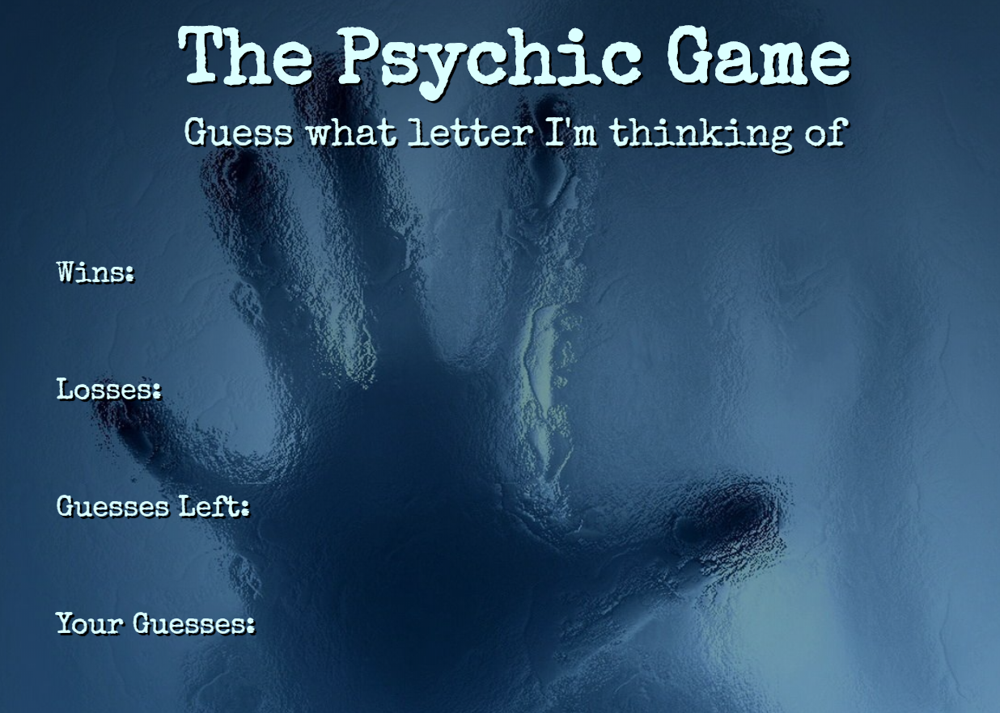

# Psychic Game

### Description

- The app randomly picks a letter, and the user has to guess which letter the app chose.
- The app show the number of wins and losses as well as the letters guessed so far.
- _**[Click here](https://xtrachase.github.io/Psychic-Game/)**_ to visit the deployed site

## What I Learned

- How to javascript to iterate through array and perform functions
- How to update the html using Javascript

### Technologies

- HTML
- CSS
- Javascript

